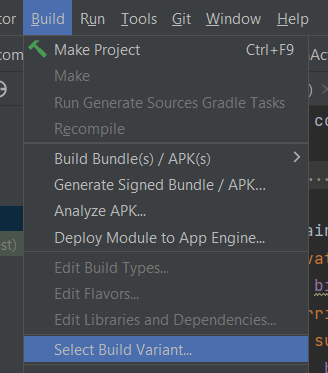
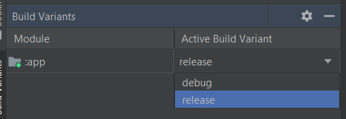
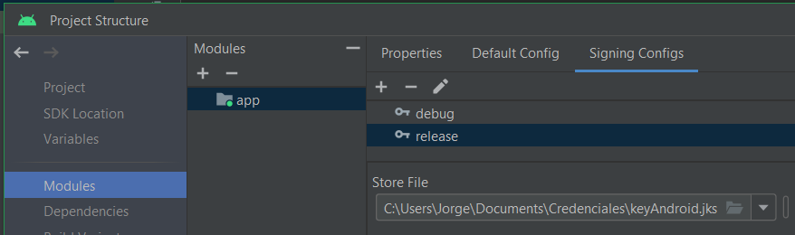
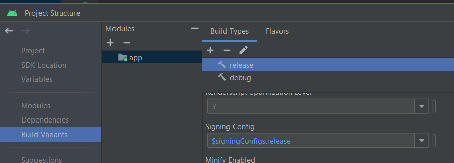
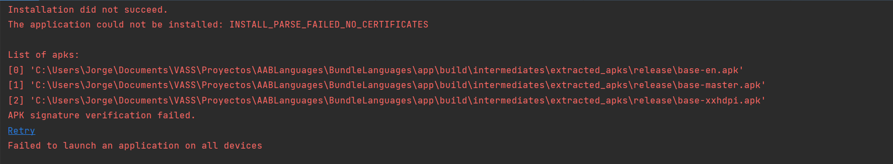
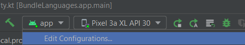
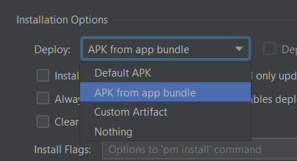

# Gestión de idiomas en Android App Bundles

## AAB Deploy en Android emulator

### 1. Seleccionar la build variant a release



### 2. Configurar release build variant

En Project Structure, selecciona modules y configura una signing configuration para release. 


En Build Variants, selecciona release y elige la signing configuration.


Si no se configura una signing configuration, se obtiene el siguiente error:


### 3. Instalar AAB en Android emulator




## Code Snippets

#### Obtener los idiomas instalados en el dispositivo

```kotlin
val installedLocales: MutableList<Locale> = mutableListOf()
for (i in 0 until resources.configuration.locales.size()) {
    installedLocales.add(resources.configuration.locales.get(i))
}
```
resources se llama desde un contexto, por ejemplo, desde un Activity. En este caso,

resources.configuration.locales es de tipo LocaleList, que es una clase que hereda de LocaleListBase, que a su vez hereda de LocaleListInterface. LocaleListInterface es una interfaz que define los métodos get(index: Int) y size().

#### Obtener los idiomas disponibles en el dispositivo

```kotlin
val allLocales : MutableList<String> = mutableListOf()
allLocales.addAll(Locale.getAvailableLocales().map { it.displayName })
```

Locale.getAvailableLocales() devuelve un array de Locale.


## Referencias

* [Acerca de Android App Bundles - developer.android.com](https://developer.android.com/guide/app-bundle?hl=es-419)
* [Como localizar tu app - developer.android.com](https://developer.android.com/guide/topics/resources/localization?hl=es-419)